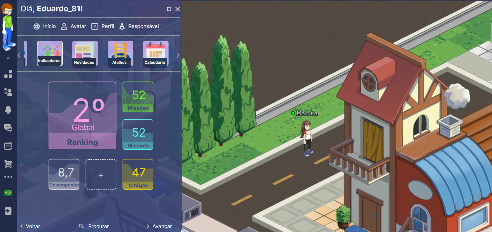

<h2 align="center">
 📱 Metaverso App
</h2>

<h4 align="center"><a href="https://metaverso-app.vercel.app/">Clique para visitar o projeto</a></h4>

<h4 align="center"><a href="https://www.figma.com/file/PVXTyF7pz45BxeaMX7I4gz/Teste?type=design&node-id=12-354&mode=design&t=E0mM11e9aKh6Jd1y-0">Link do Figma</a></h4>

<h4 align="center">
Esta é uma aplicação Frontend que utiliza Typescript, NextJs e Styled Components.
</h4>

<div align="center">
     
</div>

## 🎯 Tecnologias utilizadas

- Next.js
- TypeScript
- Styled Components

## ⚙️ Como executar

Após clonar o repositório, acesse a pasta do projeto e execute os comandos abaixo:

```sh
yarn
yarn dev
```

Acesse http://localhost:3000 para visualizar a aplicação.
